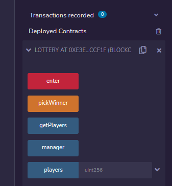

# Lottery smart contract (solidity)

## Setup

**Prerequisites**: you will need Node.js in order to set up the project.

1. Checkout code from git - `git clone https://github.com/pavel-vasiluk/solidity-lottery-contract.git`
2. Run `npm install` to install project packages
3. Then proceed to https://infura.io/ in order to create Ethereum rinkeby network endpoint (used for testnet deployments)
4. Then proceed with Metamask setup: add metamask extension to google chrome, copy mnemonic (secret recovery phrase), switch account to rinkeby network, and populate it with some ETH amount (e.g. 0.05 ETH)
5. Create `.env` file based on provided `.env.example`. Add dotenv variables for your own mnemonic and rinkeby network endpoint 
6. Open `Lottery.sol` to get familiar with smart contract logic
7. Run `node deploy.js` in order to deploy smart contract to the test (rinkeby) network. Afterwards copy contract hash from console `Contract deployed to` message
8. Proceed to https://rinkeby.etherscan.io/ to review deployed smart contract details
9. In order to manually test publicly deployed smart contract:
   1. Proceed to http://remix.ethereum.org/ -> `File explorers`. Copy your smart contract content to `contracts` folder. Compile it
   2. Proceed to `Deploy & Run Transactions`
   3. Select `Injected Web3` environment. Authenticate with your Metamask rinkeby network account
   4. Paste your smart contract hash and press `At Address`
   5. Smart contract should start being operable via remix UI. For example, you can enter the lottery and so on. 

   

## Testing

In order to test smart contract behaviour, run `npm run test`